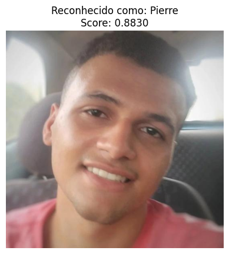

Utilizando um modelo VGGFACE2 no PyTorch para a criação de uma arquitetura de metric learning baseado num dataset com quase 3 mil classes de celebridades. Essencial para sistemas de detecção de face, onde é preciso constatemente alterar o banco de dados, com o metric learning não existe a necessidade de retreinar o modelo várias vezes.

